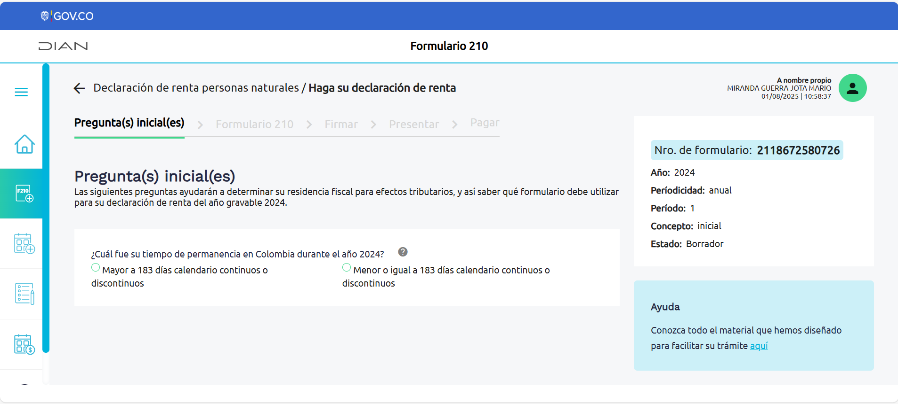
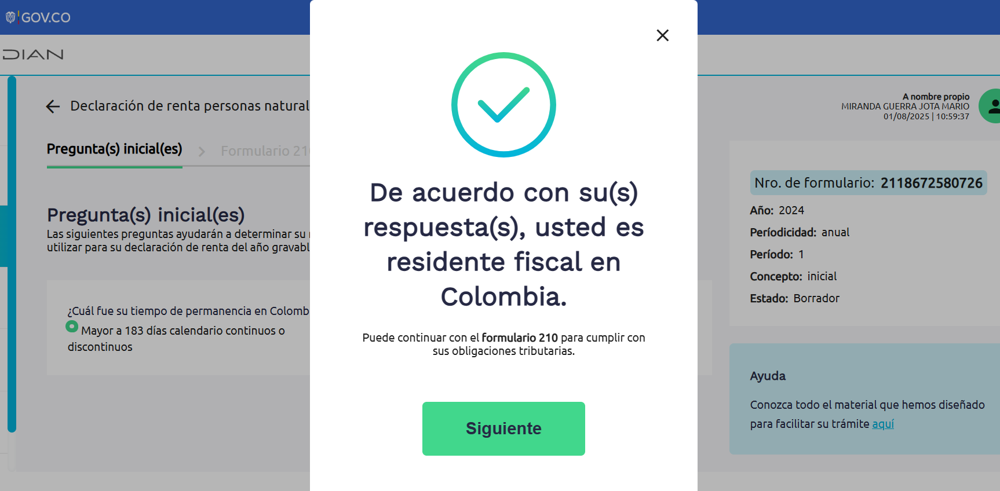

# Formuario
El siguiente es una descripcion del formulario de decalracion de renta de la DIAN.

## Seccion 1. Pregunta(s) inicial(es)

Las siguientes preguntas ayudarán a determinar su residencia fiscal para efectos tributarios, y así saber qué formulario debe utilizar para su declaración de renta del año gravable 2024.

1. ¿Cuál fue su tiempo de permanencia en Colombia durante el año 2024?

 -  Mayor a 183 días calendario continuos o discontinuos
 - Menor o igual a 183 días calendario continuos o discontinuos

 Si la respuesta es Mayor a 183 días se despliega una modal indicando:

 De acuerdo con su(s) respuesta(s), usted es residente fiscal en Colombia. Puede continuar con el formulario 210 para cumplir con sus obligaciones tributarias.

 

 Si la respuesta es Menor o igual a 183 entonces se habilita una nueva pregunta:

2. ¿Completó un periodo de permanencia continua o discontinua en Colombia de más de 183 días, durante cualquier período de 365 días calendario iniciado en 2022 y finalizado en 2024?  

- Si
- No

Si la respuesta es Si se despliega una modal indicando:

 De acuerdo con su(s) respuesta(s), usted es residente fiscal en Colombia. Puede continuar con el formulario 210 para cumplir con sus obligaciones tributarias.

Si la respuesta es No aparece una nueva pregunta:

3. ¿Tiene usted nacionalidad colombiana?

- Si
- No

Si la respuesta es Si aparece un nueva pregunta:

4. ¿Por el año 2024, usted y los integrantes de su núcleo familiar que habiten la misma casa estuvieron al servicio del estado colombiano en el exterior? (Si usted no está al servicio del estado colombiano, pero vive en el exterior con una persona que sí lo está, debe marcar Sí)

- Si
- No

Si la respuesta es Si se despliega una modal indicando:

 De acuerdo con su(s) respuesta(s), usted es residente fiscal en Colombia. Puede continuar con el formulario 210 para cumplir con sus obligaciones tributarias.

Si la respuesta es No se despliega una modal indicando: 
De acuerdo con su(s) respuesta(s), usted NO es residente fiscal en Colombia. Realice su declaración en el formulario 110.

## Seccion 2. Formulario 210

5. Número de Identificación Tributaria (NIT) 
5555555555555
6. DV. 
8
7. Primer apellido 
MIRANDA
8. Segundo apellido 
GUERRA
9. Primer nombre 
JOTA
10. Otros nombres 
MARIO
286. Género
Lista desplegable con las opciones:
- Masculino
- Femenino
- No binario
- Otro
- No responde
12. Cód. Dirección Seccional 
4
24. Actividad económica (seleccione su principal fuente de ingresos) 
Lista desplegable con opciones como:
Código	Descripción
0010	Asalariados
0020	Pensionados
0081	Personas naturales sin actividad económica
0082	Personas naturales subsidiadas por terceros
0090	Rentistas de capital (solo personas naturales)
0111	Cultivo de cereales, legumbres y semillas oleaginosas
0123	Cultivo de café
0141	Cría de ganado bovino y bufalino
0150	Explotación mixta (agrícola y pecuaria)
0210	Silvicultura y otras actividades forestales
0311	Pesca marítima
0510	Extracción de hulla (carbón de piedra)

299. ¿Adquirió bienes y/o servicios con factura electrónica cumpliendo requisitos núm 5 art. 336 E.T.?
   Sí
   No
245. ¿Ha retirado cesantías acumuladas a 31 de diciembre de 2016?

  Sí

  No
247. ¿Recibió ingresos por seguros o compensaciones por el fallecimiento de un miembro de las Fuerzas Militares o de la Policía Nacional?

  Sí

  No
249. ¿Recibió ingresos adicionales al salario básico y prestaciones sociales como miembro de las Fuerzas Militares o de la Policía Nacional?

  Sí

  No
251. ¿Recibió ingresos por concepto de gastos de representación como rector y/o profesor de universidades públicas?

  Sí

  No
253. ¿Recibió ingresos por prima especial y de costo de vida como diplomático consular, administrativo del Ministerio de Relaciones Exteriores, y como servidor público de planta en el exterior?

  Sí

  No
255. ¿Recibió ingresos por rentas hoteleras?

  Sí

  No
275. ¿Recibió ingresos y/o rentas líquidas pasivas en Entidades Controladas del Exterior (ECE) por rentas de capital provenientes de la Comunidad Andina (CAN) o de un país con convenio para evitar la doble tributación?

  Sí

  No
277. ¿Recibió ingresos y/o rentas líquidas pasivas de ECE por rentas no laborales provenientes de la CAN o de un país con convenio para evitar la doble tributación?

  Sí

  No
279. ¿Recibió gastos de representación como magistrado de los tribunales, como fiscal o procurador judicial delegado ante los tribunales o como juez de la República?

  Sí

  No
282. ¿Recibió ingresos por rentas de trabajo de la CAN o por un convenio para evitar la doble tributación?

  Sí

  No

241. Tipo de documento del dependiente
242. No. identificación del dependiente
244. Parentesco

287. Tipo de Documento del dependiente 2:
288. No. Identificación dependiente 2:
289. Parentesco 2:

290. Tipo de Documento del dependiente 3:
291. No. Identificación dependiente 3:
292. Parentesco 3:

293. Tipo de Documento del dependiente 4:
294. No. Identificación dependiente 4:
295. Parentesco 4:

357. Tipo de documento dependiente asociado a la deducción del 10%:

358. No. Identificación dependiente asociado a la deducción del 10%:
359. Parentesco dependiente asociado a la deducción del 10%:

138. Número de dependientes económicos
Es de solo lectura autocalculado por la cantidad de dependientes registrados.
139. Adición por dependientes a la casilla 92

29. Patrimonio bruto
0
30. Deudas
0
31. Total patrimonio líquido
Es de solo lectura autocalculado como la suma de los campos anteriores

355. Salarios
0
356. Honorarios sin costos
0
32. Ingresos brutos
0
33. Ingresos no constitutivos de renta
0
34. Renta líquida

Rentas exentas
Las rentas exentas reducen el impuesto por pagar.

35. Aportes voluntarios AFC, FVP y/o AVC 
0
36. Otras rentas exentas 
0
37. Total rentas exentas 
Es de solo lectura autocalculado como la suma de los campos anteriores

Deducciones imputables
Las deducciones imputables reducen el impuesto por pagar.

38. Intereses de vivienda
0
39. Otras deducciones imputables
0
40. Total deducciones imputables
Es de solo lectura autocalculado como la suma de los campos anteriores
41. Rentas exentas y/o deducciones imputables (limitadas) 
Es de solo lectura autocalculado como la suma de los campos anteriores
42. Renta líquida ordinaria 
Es de solo lectura autocalculado como la suma de los campos anteriores

Rentas de trabajo que no provengan de una relación laboral o legal y reglamentaria.
43. Ingresos brutos 
0
44. Ingresos no constitutivos de renta 
0
45. Costos y deducciones procedentes 
0
140. ¿Superó el tope indicativo relativo al art. 336-1 del E.T.? 
   Sí
   No
46. Renta líquida 
Es de solo lectura autocalculado como la suma de los campos anteriores

58. Ingresos brutos
0
59. Ingresos no constitutivos de renta
0
60. Costos y deducciones procedentes
0
61. Renta líquida
Es de solo lectura autocalculado como la suma de los campos anteriores
62. Rentas líquidas pasivas ECE
0

Rentas no laborales
Son ingresos que no se clasifican explícitamente en ninguna de las demás categorías y aquellos que no cumplan con la definición de servicios personales.

74. Ingresos brutos 
0
75. Devoluciones, rebajas y descuentos 
0
76. Ingresos no constitutivos de renta 
0
77. Costos y deducciones procedentes 
0
78. Renta líquida 
Es de solo lectura autocalculado como la suma de los campos anteriores
79. Rentas líquidas pasivas ECE

Cédula general
Están incorporados los ingresos por concepto de rentas de trabajo, de capital y no laborales.

91. Renta líquida cédula general
0
92. Rentas exentas y deducciones imputables limitadas
0
93. Renta líquida ordinaria cédula general
0
94. Compensaciones por pérdidas año gravable 2018 y anteriores
0
95. Compensaciones por exceso de renta presuntiva
0
96. Rentas gravables
0
97. Renta líquida gravable cédula general
0
98. Renta presuntiva

Cédula de pensiones
Son ingresos de las pensiones de jubilación, invalidez, vejez, de sobrevivientes y sobre riesgos laborales, junto con las indemnizaciones sustitutivas de pensiones y las devoluciones de saldos de ahorro pensional.

99. Ingresos brutos por rentas de pensiones del país y del exterior
0
100. Ingresos no constitutivos de renta
0
101. Renta líquida
0
102. Rentas exentas de pensiones
0
103. Renta líquida cedular de pensiones
0

Cédula de dividendos y participaciones
Incluya los ingresos por dividendos y participaciones recibidas de sociedades nacionales y extranjeras. Estos ingresos están sujetos a impuestos para personas naturales residentes y sucesiones ilíquidas, según lo establecido en el artículo 343 del Estatuto Tributario. Ver más

104. Dividendos y participaciones 2016 anteriores y otros
0
105. Ingresos no constitutivos de renta
0
106. Renta líquida ordinaria año 2016 y anteriores
0
107. 1a. Subcédula año 2017 y siguientes numeral 3 art. 49 del E.T.
0
108. 2a. Subcédula año 2017 y siguientes, parágrafo 2° art. 49 del E.T.
0
109. Dividendos y participaciones recibidas del exterior
0
110. Rentas exentas de la casilla 109
0

Cédula de dividendos y participaciones: Otras Tarifas 2° Subcédula art 49 del E.T.
Dividendos y participaciones: Otras Tarifas 2° Subcédula art 49 del E.T.

304. Tarifa 1: 
0
305. Base 1: 
0
306. Impuesto dividendo 1: 
0
307. Tarifa 2: 
0
308. Base 2: 
0
309. Impuesto dividendo 2: 
0
310. Tarifa 3: 
0
311. Base 3: 
0
312. Impuesto dividendo 3: 
0
313. Tarifa 4: 
0
314. Base 4: 
0
315. Impuesto dividendo 4: 
0
319. Tarifa 5: 
0
318. Base 5: 
0
317. Impuesto dividendo 5: 
0
322. Tarifa 6: 
0
321. Base 6: 
0
320. Impuesto dividendo 6: 
0
325. Tarifa 7: 
0
324. Base 7: 
0
323. Impuesto dividendo 7: 
0
328. Tarifa 8: 
0
327. Base 8: 
0
326. Impuesto dividendo 8: 
0
331. Tarifa 9: 
0
330. Base 9: 
0
329. Impuesto dividendo 9: 
0
334. Tarifa 10: 
0
333. Base 10: 
0
332. Impuesto dividendo 10: 

Ganancia ocasional
Recuerde incluir en esta sección las ganancias ocasionales generadas por rentas pasivas de las Entidades Controladas del Exterior (ECE)

112. Ingresos por ganancias ocasionales del país y del exterior
0
113. Costos por ganancias ocasionales
0
114. Ganancias ocasionales no gravadas y exentas
0
115. Ganancias ocasionales gravables 

Liquidación privada
111. Renta líquida gravable (Cédula general o renta presuntiva, de pensiones y dividendos y participaciones, art. 241 E.T.)
0
Declaración presentada por el contribuyente de forma voluntaria

Impuesto sobre las rentas líquidas gravables
116. Cédula general, de pensiones y de dividendos y participaciones
0
117. Presuntiva, cédula de pensiones y de dividendos y participaciones
0
118. Por dividendos y/o participaciones año 2017 y siguientes, 2a subcédula (Art. 240 E.T.)
0
119. Por dividendos y/o participaciones año 2016
0
120. Por dividendos y participaciones recibidas del exterior
0
121. Total impuesto sobre las rentas líquidas gravables
0
Descuentos
122. Impuestos pagados en el exterior
0
123. Donaciones
0
296. Descuento tributario artículo 254-1 renta líquida cedular dividendos y participaciones
0
124. Dividendos, participaciones y otros
0
125. Total Descuentos tributarios
0
126. Impuesto neto de renta
0
127. Impuesto de ganancias ocasionales
0
128. Descuento por impuestos pagados en el exterior por ganancias ocasionales
0
129. Total impuesto a cargo
0
130. Anticipo renta liquidado año gravable anterior
0
131. Saldo a favor del año gravable anterior sin solicitud de devolución y/o compensación
0
132. Retenciones año gravable a declarar:
0
133. Anticipo renta para el año gravable siguiente
0
134. Saldo a pagar por impuesto
0
135. Sanciones
0
136. Total saldo a pagar
0
137. Total saldo a favor
0
141. Aporte voluntario

